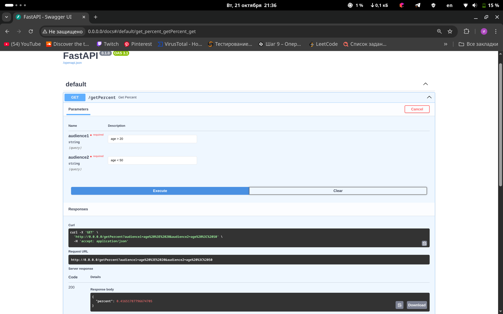

Для запуска достаточно в терминале ввести команду:
docker compose up

Дамп базы данных находится в init/data_1.csv,
с ним же рядом расположился SQL скрипт который добавляет данные в PosgreSQL.

Основная логика(средний weight в src/api/respondents), 
там же и сам endpoint, который потом мы подключаем в main.

при клонировании желательно выполнить и заполнить .env своими данными
cp .env.template .env \

в остальном все моменты задания учтены:\
1. один GET эндпоинт /getPercent
2. вычислить процент вхождения второй аудитории в первую, основываясь на среднем Weight
3. Средний Weight не может быть разным у одного и того же респондента

в браузере доступен по http://0.0.0.0:80/docs

